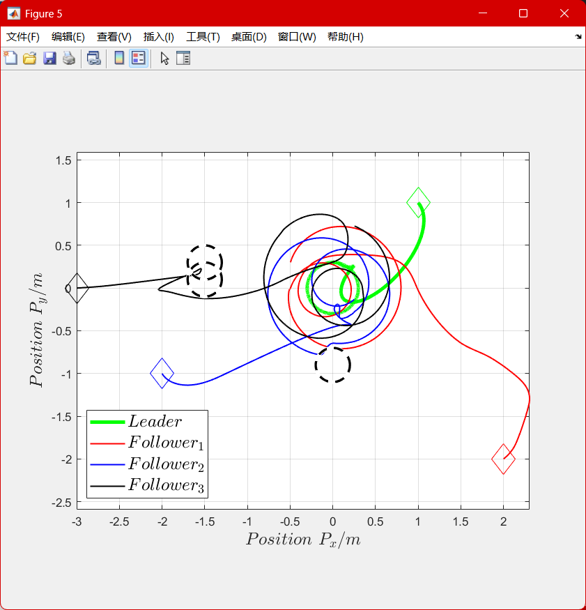
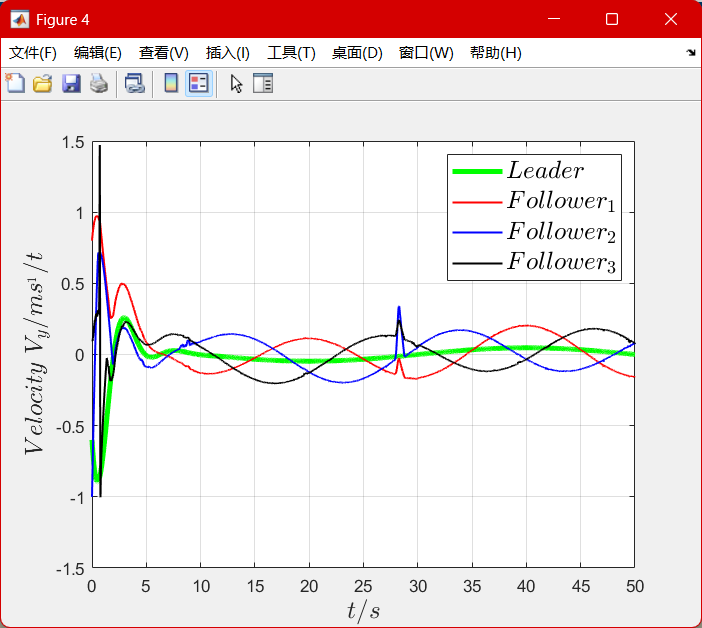
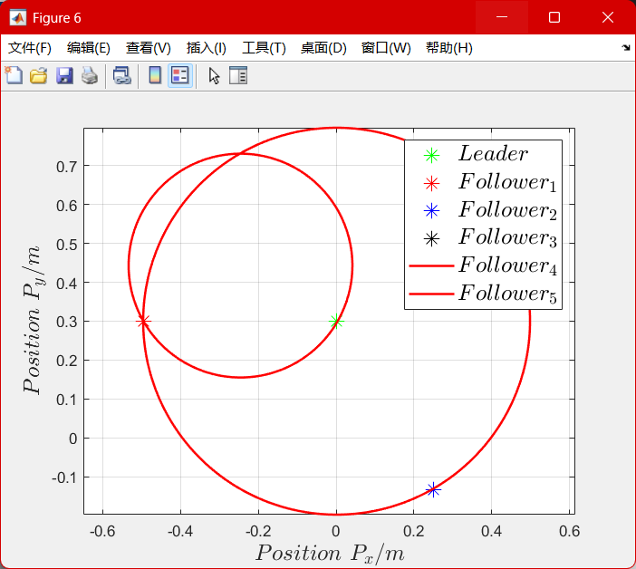

# 考虑领导者机动加速度编队跟踪+改进APF——说明

在王建华程序上增加了改进APF部分：

## 原有程序

一领导者，三跟随者，领导者做绕圈机动

控制协议：

```matlab
U_foll = kron(eye(3), kron(eye(2), K_1))*(X(5:16) - kron(D*N_1, X(1:4))) ...
       + c_1*kron(L_H, kron(eye(2), K_2))*(X(5:16) - calcul_three_formation_h(w,r,t)) ...
       - c_1*kron(eye(3), kron(eye(2), K_2))*(kron(D*H*N_1, X(1:4))) ...
       + c_2*sign(kron(L_H, kron(eye(2), K_2))*(X(5:16) - calcul_three_formation_h(w,r,t)) ...
                  - kron(eye(3), kron(eye(2), K_2))*(kron(D*H*N_1, X(1:4))));
```

$$
U_{\text{foll}} = \underbrace{K_1 (X_{\text{foll}} - D \otimes X_{\text{leader}})}_{\text{跟踪误差}} + \underbrace{c_1 L_H K_2 (X_{\text{foll}} - h_{\text{formation}})}_{\text{编队一致性}} + \underbrace{c_2 \cdot \text{sign}(\cdot)}_{\text{鲁棒项}}
$$

## 新增内容

参考论文《An Improved Artificial Potential Field Method for Path Planning and Formation Control of the Multi-UAV Systems》（IEEE TCSII, 2022）

其方法简单可总结如下：

总控制力：
$$
u_i = F_a + \sum_{i=1}^m F_r + \sum_{j=1, j \neq i}^n F_{ij} + F_e - k_d \dot{q}_i
$$
含义如下：

| 项               | 含义             | 来源                     |
| ---------------- | ---------------- | ------------------------ |
| $F_a$            | 吸引力：朝向目标 | 来自目标点               |
| $F_r$            | 斥力：避障       | 来自障碍物               |
| $F_{ij}$         | 编队保持力       | 与其他UAV保持角度和距离  |
| $F_e$            | 旋转力场         | 仅当陷入局部最小值时激活 |
| $-k_d \dot{q}_i$ | 阻尼             | 减震平稳化运动           |

我使用了其中的斥力、旋转力、阻尼力三项加到源程序中，即现在有：

U_foll = 状态反馈项 + 一致性项 + 滑模项 + 改进APF（斥力+旋转力+阻尼力）；

然后调了一组我觉得效果较好的参数

### 结果简单分析

运行仿真：运行threeFollowers_formation_tracking_simulationTest.m。



这是二维的智能体路径，为了展示旋转力的效果，故意设置了两个障碍物堵住智能体3（黑色）前进路线，发现其在斥力和旋转力共同作用下能够跳出局部最优；



在约t=28时，智能体2触发避障，而智能体3虽无避障问题，但因一致性控制协议相应受到扰动；另，如果放大图象可以看到滑模部分带来的抖动；



t->50s时的结果，可以看到各智能体成功收敛到目标位置。