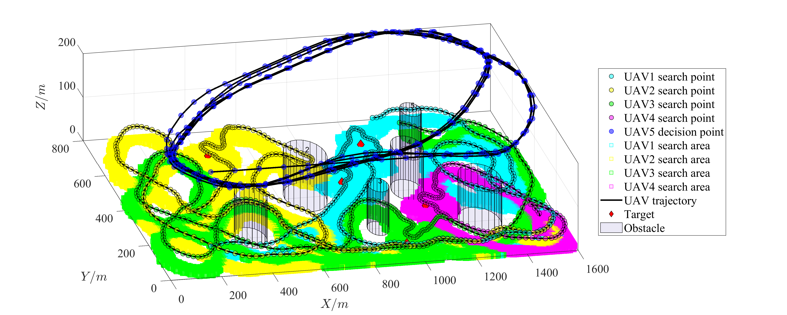

# 快速入门
此程序不使用特定工具箱，可以在较低版本的 MATLAB 中使用。程序使用步骤如下：
1. 在 MATLAB 中打开 UAV_Cooperative_Search 文件夹。
2. 打开文件“run_demo.m”，设置demo_index=1，运行脚本。程序每十次搜索决策更新一次图中的搜索结果。最后，您将看到4架同质无人机与
   静止障碍物的搜索结果。每次运行程序时，搜索结果可能都不同。
   []
3. 打开文件“run_demo.m”，设置demo_index=2，运行脚本，可以看到5架异型无人机与静止障碍物的搜索结果，在无人机轨迹图中，
   可以使用Rotate 3D工具调整视角。
   []
4. 打开文件“run_demo.m”，设置demo_index=3，运行脚本，可以看到5架异构无人机在动态障碍物下的搜寻结果。程序完成后，
   运行如下程序，可以生成无人机协同搜寻过程的视频。
   ```
   F=Plot_UAV_Trajectory_Dynamic(map,GS,UAV_Coordinate,TAR,OBS);
   h=figure;
   set(gcf,'unit','inches','position',[0,0,14,6]);
   movie(h,F,1,10);
   v=VideoWriter('Trajectory.mp4','MPEG-4');
   v.FrameRate=10;
   v.Quality=100;
   open(v);
   writeVideo(v,F);
   close(v);
   ```
运行上面这段代码可能会出现以下报错，这是把动画过程输出成视频的错误可以不用理会。
错误使用 VideoWriter/writeVideo (line 410)
写入文件 需要先初始化此对象，然后才能执行请求的操作。 时出现意外错误